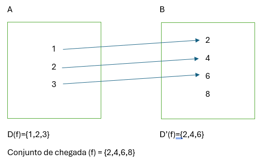
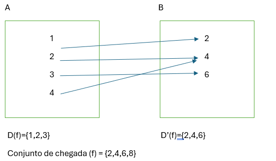
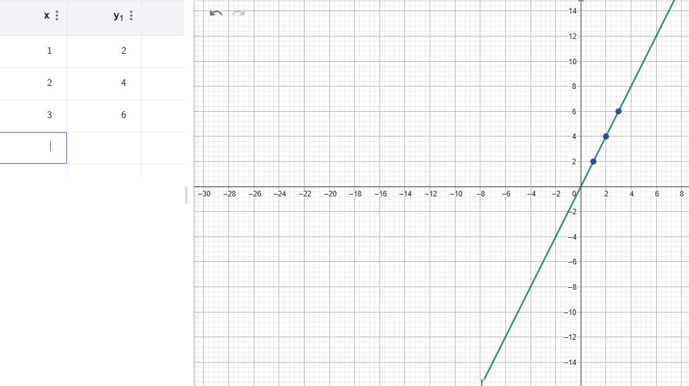
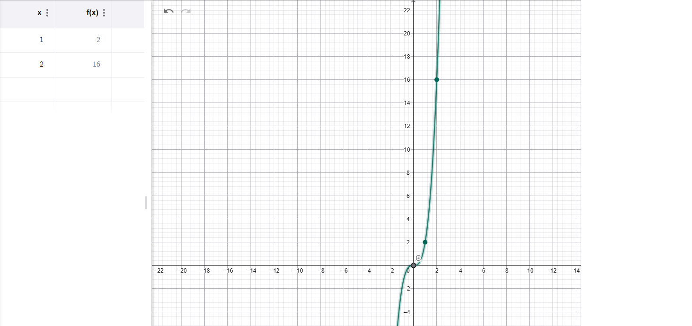
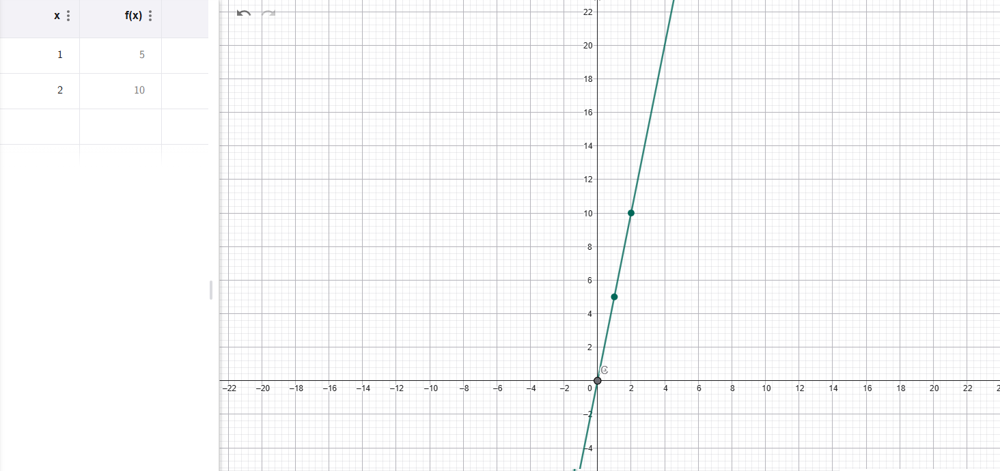

# 📘 Resumo – Conjuntos, Funções e Matrizes

## ✔️ Símbolos e Operações de Conjuntos

| Símbolo | Nome | Significado | Exemplo |
|--------|------|-------------|---------|
| ∈ | Pertence | O elemento está no conjunto | A={1,2,3}, 3 ∈ A |
| ∉ | Não pertence | O elemento não está no conjunto | A={1,2,3}, 5 ∉ A |
| ⊂ | Subconjunto próprio | A está contido em B, mas A ≠ B | A={1,2}, B={1,2,3}, A ⊂ B |
| ⊆ | Subconjunto | A está contido em B (pode ser igual) | A={1,2,3}, B={1,2,3}, A ⊆ B |
| ⊃ | Contém | B está contido em A | A={1,2,3}, B={1,2}, A ⊃ B |
| ⊇ | Contém ou é igual | A contém B ou A=B | A={1,2,3}, B={1,2,3}, A ⊇ B |
| C | Complementar | Elementos fora de A no universo | A⊆ℤ⁺ → Aᶜ = ℤ₀⁻ |
| = | Igualdade | Mesmos elementos | A=B |
| ≠ | Diferente | Conjuntos distintos | A ≠ B |
| ∪ | União | Elementos que estão em A ou B | A={1,2,3}, B={2,4} → A∪B={1,2,3,4} |
| ∩ | Interseção | Elementos em comum | A={1,2,3}, B={2,3,4} → A∩B={2,3} |
| − ou ∖ | Diferença | Elementos em A que não estão em B | A−B={1} |
| ∅ | Conjunto vazio | Sem elementos | ∅ |
| U | Universo | Conjunto total considerado | U={1..5} |
| ℕ | Naturais | {0,1,2,3…} |
| ℤ | Inteiros | {...,−1,0,1,...} |
| ℚ | Racionais | a/b | 1/2, 3/10 |
| ℝ | Reais | Inclui irracionais | √7, π |
| ∀ | Para todo | Quantificador universal | ∀x∈ℝ: x²≥0 |
| ∃ | Existe | Quantificador existencial | ∃x∈ℝ: x²=4 |

---

## ✔️ Produto Cartesiano e Relações

### **Produto cartesiano**
A × B = conjunto de todos os pares ordenados.

A={a,b}
B={1,2}
A×B = {(a,1),(a,2),(b,1),(b,2)}

markdown
Copiar código

### **Relação entre conjuntos**
Subconjunto do produto cartesiano.

### **Relação inversa**
R = {(a,1),(b,2)} → R⁻¹ = {(1,a),(2,b)}

yaml
Copiar código

---

## ✔️ Divisibilidade e Congruências

### **Divisibilidade**
b divide a (b | a) se ∃k∈ℤ tal que a = b·k.

### **Congruência**
a ≡ b (mod n) se n | (a − b).

---

# FUNÇÕES

## ✔️ Definição de Função
Cada elemento do domínio tem **uma única imagem**.

### ✔️ Exemplo de função

### ✔️ Exemplo de relação que não é função

---

## ✔️ Função Injetiva
f(x₁)=f(x₂) implica x₁=x₂.

Exemplo: f(x)=2x  

---

## ✔️ Função Sobrejetiva
O conjunto de chegada = contradomínio.

Exemplo: f(x)=x³  

---

## ✔️ Função Bijetiva
Injetiva + sobrejetiva.

Exemplo: f(x)=x+5  

---

# MATRIZES

## ✔️ Tipos de Matrizes

- Matriz Am×n → m linhas, n colunas  
- Matriz nula  
- Matriz quadrada  
- Matriz retangular  
- Matriz linha  
- Matriz coluna  
- Diagonal principal (aᵢᵢ)  
- Triangular superior  
- Triangular inferior  
- Matriz escalar (λ)  
- Matriz identidade (I)

---

## ✔️ Operações com Matrizes

### **Soma / Diferença**
Só possível entre matrizes da mesma ordem.

### **Multiplicação**
A m×n multiplica B n×p → resultado m×p.

---

# TRANSPOSTA DE MATRIZ

## ✔️ Definição
Troca linhas por colunas.

\[
A = \begin{pmatrix}
1 & 2 \\
3 & 4 \\
5 & 6
\end{pmatrix}
\Rightarrow
A^T =
\begin{pmatrix}
1 & 3 & 5 \\
2 & 4 & 6
\end{pmatrix}
\]

### ✔️ Propriedades

- \((A^T)^T = A\)
- \((A + B)^T = A^T + B^T\)
- \((kA)^T = kA^T\)
- **\((AB)^T = B^T A^T\)**

---

# MATRIZ INVERSA

## ✔️ Definição
A matriz A é inversível se:

\[
AA^{-1} = A^{-1}A = I
\]

## ✔️ Inversa de 2×2

\[
A = \begin{pmatrix} a & b \\ c & d \end{pmatrix}
\]

\[
A^{-1} = \frac{1}{ad - bc}
\begin{pmatrix}
d & -b \\
-c & a
\end{pmatrix}
\]

Se **ad−bc = 0**, não existe inversa.

### ✔️ Exemplo

\[
A = \begin{pmatrix}
1 & 2 \\
3 & 4
\end{pmatrix}
\]# 📘 Resumo – Conjuntos, Funções e Matrizes

## ✔️ Símbolos e Operações de Conjuntos

| Símbolo | Nome | Significado | Exemplo |
|--------|------|-------------|---------|
| ∈ | Pertence | O elemento está no conjunto | A={1,2,3}, 3 ∈ A |
| ∉ | Não pertence | O elemento não está no conjunto | A={1,2,3}, 5 ∉ A |
| ⊂ | Subconjunto próprio | A está contido em B, mas A ≠ B | A={1,2}, B={1,2,3}, A ⊂ B |
| ⊆ | Subconjunto | A está contido em B (pode ser igual) | A={1,2,3}, B={1,2,3}, A ⊆ B |
| ⊃ | Contém | B está contido em A | A={1,2,3}, B={1,2}, A ⊃ B |
| ⊇ | Contém ou é igual | A contém B ou A=B | A={1,2,3}, B={1,2,3}, A ⊇ B |
| C | Complementar | Elementos fora de A no universo | A⊆ℤ⁺ → Aᶜ = ℤ₀⁻ |
| = | Igualdade | Mesmos elementos | A=B |
| ≠ | Diferente | Conjuntos distintos | A ≠ B |
| ∪ | União | Elementos que estão em A ou B | A={1,2,3}, B={2,4} → A∪B={1,2,3,4} |
| ∩ | Interseção | Elementos em comum | A={1,2,3}, B={2,3,4} → A∩B={2,3} |
| − ou ∖ | Diferença | Elementos em A que não estão em B | A−B={1} |
| ∅ | Conjunto vazio | Sem elementos | ∅ |
| U | Universo | Conjunto total considerado | U={1..5} |
| ℕ | Naturais | {0,1,2,3…} |
| ℤ | Inteiros | {...,−1,0,1,...} |
| ℚ | Racionais | a/b | 1/2, 3/10 |
| ℝ | Reais | Inclui irracionais | √7, π |
| ∀ | Para todo | Quantificador universal | ∀x∈ℝ: x²≥0 |
| ∃ | Existe | Quantificador existencial | ∃x∈ℝ: x²=4 |

---

## ✔️ Produto Cartesiano e Relações

### **Produto cartesiano**
A × B = conjunto de todos os pares ordenados.

A={a,b}
B={1,2}
A×B = {(a,1),(a,2),(b,1),(b,2)}

markdown
Copiar código

### **Relação entre conjuntos**
Subconjunto do produto cartesiano.

### **Relação inversa**
R = {(a,1),(b,2)} → R⁻¹ = {(1,a),(2,b)}

yaml
Copiar código

---

## ✔️ Divisibilidade e Congruências

### **Divisibilidade**
b divide a (b | a) se ∃k∈ℤ tal que a = b·k.

### **Congruência**
a ≡ b (mod n) se n | (a − b).

---

# FUNÇÕES

## ✔️ Definição de Função
Cada elemento do domínio tem **uma única imagem**.

### ✔️ Exemplo de função

### ✔️ Exemplo de relação que não é função

---

## ✔️ Função Injetiva
f(x₁)=f(x₂) implica x₁=x₂.

Exemplo: f(x)=2x  

---

## ✔️ Função Sobrejetiva
O conjunto de chegada = contradomínio.

Exemplo: f(x)=x³  

---

## ✔️ Função Bijetiva
Injetiva + sobrejetiva.

Exemplo: f(x)=x+5  

---

# MATRIZES

## ✔️ Tipos de Matrizes

- Matriz Am×n → m linhas, n colunas  
- Matriz nula  
- Matriz quadrada  
- Matriz retangular  
- Matriz linha  
- Matriz coluna  
- Diagonal principal (aᵢᵢ)  
- Triangular superior  
- Triangular inferior  
- Matriz escalar (λ)  
- Matriz identidade (I)

---

## ✔️ Operações com Matrizes

### **Soma / Diferença**
Só possível entre matrizes da mesma ordem.

### **Multiplicação**
A m×n multiplica B n×p → resultado m×p.

---

# TRANSPOSTA DE MATRIZ

## ✔️ Definição
Troca linhas por colunas.

\[
A = \begin{pmatrix}
1 & 2 \\
3 & 4 \\
5 & 6
\end{pmatrix}
\Rightarrow
A^T =
\begin{pmatrix}
1 & 3 & 5 \\
2 & 4 & 6
\end{pmatrix}
\]

### ✔️ Propriedades

- \((A^T)^T = A\)
- \((A + B)^T = A^T + B^T\)
- \((kA)^T = kA^T\)
- **\((AB)^T = B^T A^T\)**

---

# MATRIZ INVERSA

## ✔️ Definição
A matriz A é inversível se:

\[
AA^{-1} = A^{-1}A = I
\]

## ✔️ Inversa de 2×2

\[
A = \begin{pmatrix} a & b \\ c & d \end{pmatrix}
\]

\[
A^{-1} = \frac{1}{ad - bc}
\begin{pmatrix}
d & -b \\
-c & a
\end{pmatrix}
\]

Se **ad−bc = 0**, não existe inversa.

### ✔️ Exemplo

\[
A = \begin{pmatrix}
1 & 2 \\
3 & 4
\end{pmatrix}
\]

det(A)=−2

\[
A^{-1} =
\begin{pmatrix}
-2 & 1 \\
1.5 & -0.5
\end{pmatrix}
\]

### ✔️ Propriedades

- \((A^{-1})^{-1} = A\)
- \((AB)^{-1} = B^{-1}A^{-1}\)
- \((A^T)^{-1} = (A^{-1})^T\)
- \(I^{-1} = I\)

det(A)=−2

\[
A^{-1} =
\begin{pmatrix}
-2 & 1 \\
1.5 & -0.5
\end{pmatrix}
\]

### ✔️ Propriedades

- \((A^{-1})^{-1} = A\)
- \((AB)^{-1} = B^{-1}A^{-1}\)
- \((A^T)^{-1} = (A^{-1})^T\)
- \(I^{-1} = I\)
