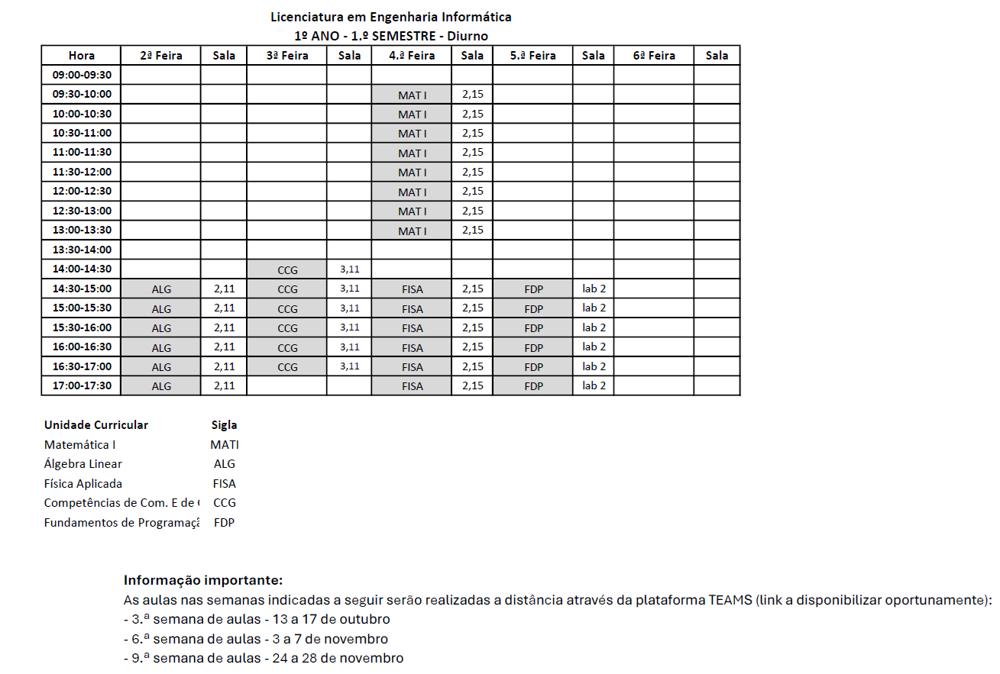

# Calendário

# Horario

# Trabalhos / Testes

|Data|Trabalho/Frequência|
|---|---|
|14/10|Caso Prático CCG|
|28/10|Caso Prático CCG|
|4/11|Aula Invertida CCG|
|11/11|Caso Prático CCG|
|17/11|Teste Álgebra Linear|
|18/11|Aula Invertida CCG|
|25/11|Caso Prático CCG|
|3/12|Caso Prático CCG|
|17/12|Aula Invertida CCG|
|6/1|Caso Prático CCG|
|7/1|Teste Física Aplicada|
|12/1|Teste Álgebra Linear|
|31/1|Entrega Full paper + Article CCG|

# Notas

- 20/10 não há matemática
- 29/10 não há física aplicada
- 24/1 há aula suplementar CCG para ajudar nos Full papers