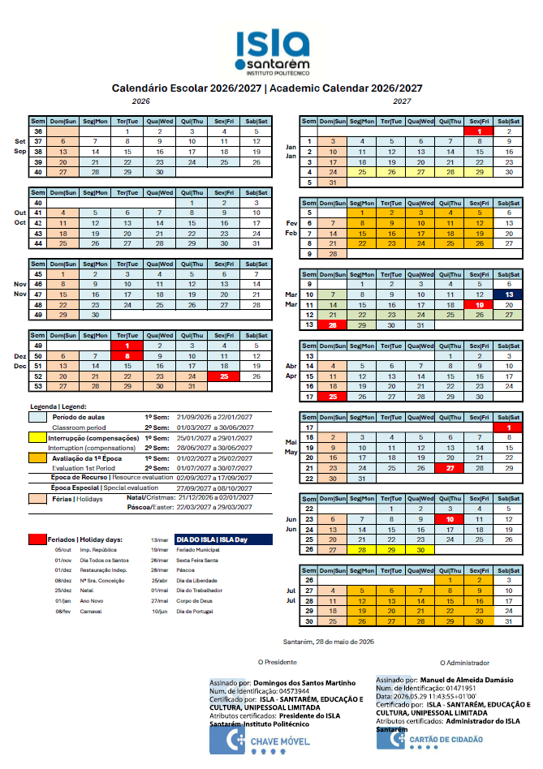
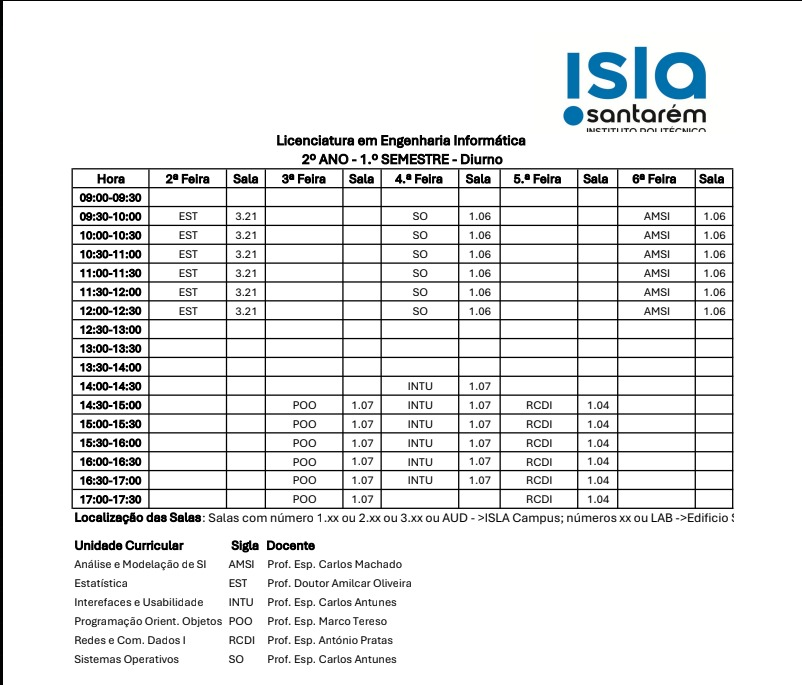

# Calendário

# Horario

# Testes

|Data|Frequência|
|---|---|
|16-4|Matemática|
|28-5|Matemática|
|8-6|Sistemas Digitais|

# Aulas Teams

- 16 a 20 de março

- 6 a 10 de abril

- 27 a 30 de abril

[link](https://teams.microsoft.com/l/meetup-join/19%3ameeting_NzY1ZTBiMTEtZTI1ZS00MjYzLWFlOWUtODM4ZDMxNDI0NGFl%40thread.v2/0?context=%7b%22Tid%22%3a%22a4d3ed6c-f1fd-469b-836b-d06701f49264%22%2c%22Oid%22%3a%2220359ae6-e935-41ac-baaa-fac74950f954%22%7d)

# Notas

[Quiz](1º-1S/física%20aplicada/questionario.html)
