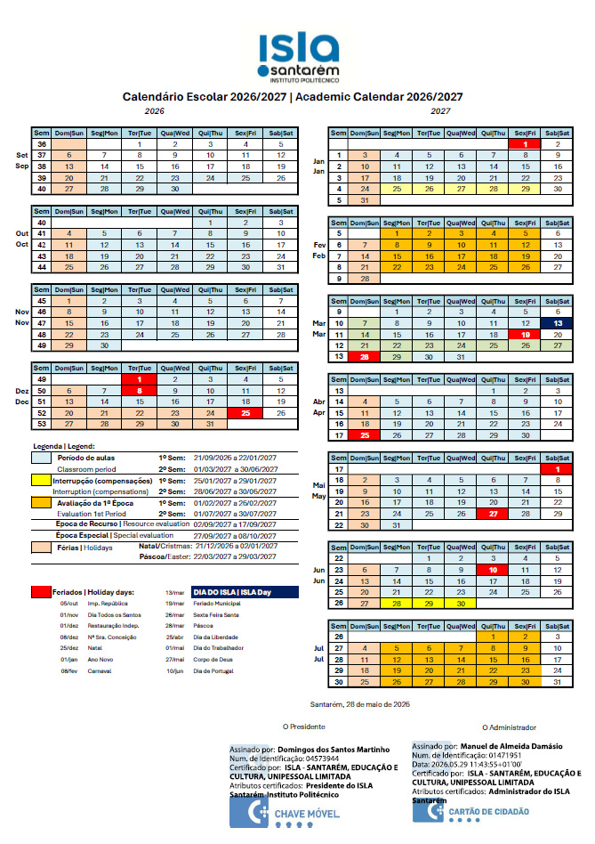
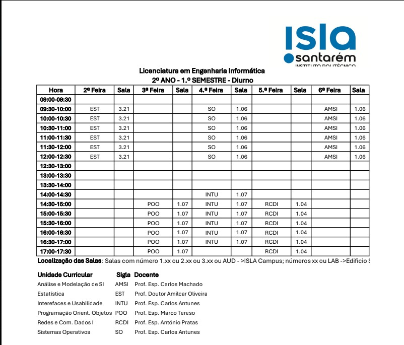

# Calendário

# Horario

# Testes

|Data|Frequência/Trabalho|
|---|---|
|26/10|Exercício estatística|
|9/11|Teste Estatística (individual)|
|16/11|Exercício estatística (em grupo)|
|07/12|Exercício estatística (individual)|
|04/1|Exercício estatística (em grupo)|
|7-1|Teste Prático POO|
|18/1|Teste Estatística|
|21-1|Trabalho de Grupo POO|

# Aulas Teams

19/10 a 23/10

23/11 a 27/11

# Notas
